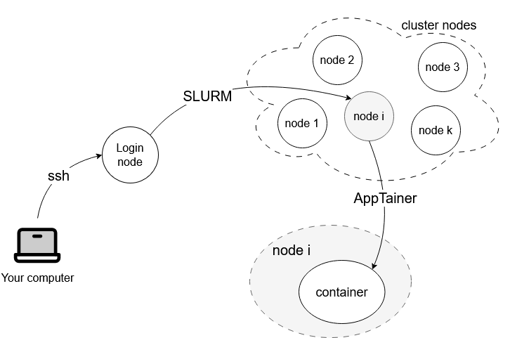

# SLURM + Apptainer: the simple mental model

If you’re new to HPC, it’s normal to have a few “wait… where is my code actually running?” moments.
This page gives you a friendly mental model of how **SLURM** (the scheduler) and **Apptainer** (the container runtime) work together on a cluster.

Briefly: you connect to the cluster, SLURM assigns you a compute node, and then your program runs there—often inside an Apptainer container.

[[_TOC_]]

---

# The one-sentence summary

- **SLURM decides *where/when* your job runs (hardware).**
- **Apptainer decides *what software environment* your command runs in (software).**

They solve different problems, and they usually work together.

---

# First: what is a “cluster” in plain words?

A cluster is a group of powerful computers (called **nodes**) shared by many people.

Most clusters have at least two “roles”:

- **Login node**: where you connect, edit files, prepare runs, and submit jobs.
- **Compute nodes**: where your jobs actually run (CPUs/GPUs live here).

The key rule of thumb:

- Use the **login node** for lightweight work.
- Use **SLURM allocations** for heavy compute.

---

# SLURM: “Please give me a machine”

SLURM is the traffic controller for the cluster.
You don’t pick a node yourself; you **request resources**, and SLURM schedules you.

## The “dream computer” metaphor

Imagine the cluster as a warehouse full of computers.
SLURM is the person at the front desk.

You walk in and say:

> “I need a computer with 4 CPU cores, 1 GPU, 32 GB RAM, and I’ll need it for 6 hours.”

SLURM’s job is to answer:

- when that exact computer (or an equivalent one) is available
- which physical machine you should use
- to make sure you don’t collide with other users asking for similar resources

What SLURM does **not** give you is an “operating system in a box”.
It gives you access to hardware resources, and it enforces fair usage.

If SLURM is brand new to you, start here:
- [Workload Managers for Dummies](/UniSR%2DHPC/SLURM/Workload-Managers-for-dummies)
- [SLURM Cheatsheet](/UniSR%2DHPC/SLURM/SLURM-%2D-Cheatsheet)

---

# Apptainer: “Please run inside this environment”

Apptainer is about the **software environment** (OS userspace + libraries + tools).

- An **image** is a file, often named `something.sif`.
- A **container** is what you get when you run something from that image.

## Two metaphors that make this click

Pick the metaphor that matches your background.

### Metaphor A — Virtual machines

- The **image** is like an **ISO file** for an operating system.
- The **container** is like the **virtual machine** you start from that ISO.

You can “start” the same ISO multiple times and get multiple VMs that behave the same.

### Metaphor B — Object-oriented programming

- The **image** is like a **class**.
- The **container** is like an **object (instance)** created from that class.

Every time you create a new object from the same class, you expect it to behave consistently.
That is exactly the point: multiple containers created from the same image are **predictably identical**.

## And what are `.def` files and Dockerfiles?

Think of an Apptainer definition file (`.def`) or a `Dockerfile` as the **source code of the class**.
It’s the instructions that define what “attributes and behavior” the image will have:

- base operating system
- installed libraries
- environment variables
- default entrypoint / run behavior

If containers are new to you:
- [Containers for Dummies](/UniSR%2DHPC/Apptainer/Containers-for-dummies)
- [Apptainer Cheatsheet](/UniSR%2DHPC/Apptainer/Apptainer-Cheatsheet)

---

# How they fit together (the important part)

A common misconception is:

> “If I use a container, I don’t need SLURM.”

You still do.
A container does *not* give you a GPU or a compute node.
It only gives you a software environment.

Another common misconception is:

> “SLURM runs inside the container.”

Usually it’s the opposite:

- SLURM starts your job on a compute node.
- Your job then starts a container as part of what it runs.

You can think of it like:

- SLURM = *Where does my code run?*
- Apptainer = *What does my code run with?*

---

# What actually happens when you submit a job

Here is the same flow, step by step.

## 1) You prepare on the login node

You typically do things like:

- edit code
- write a job script
- choose (or download) a container image
- stage data to the right storage

## 2) You submit to SLURM

At this point, your job is **in a queue**.
Nothing may happen immediately, and that’s normal.

## 3) SLURM allocates resources and starts your job

When resources are available, SLURM chooses a node (or nodes) and runs your script there.

## 4) Your script starts Apptainer

Inside the job script, you start a container and run your program inside it.
That run happens **on the compute node**, inside the container environment.

---

# Batch vs interactive (and where Apptainer fits)

There are two common ways to work on a cluster:

- **Interactive**: great for learning and debugging (you get a live shell on a compute node).
- **Batch**: great for long runs (you submit a script and let it run unattended).

In both cases, the idea stays the same:

- SLURM gives you the compute node/resources.
- Apptainer gives you the software environment.

---

# “Where are my files?” (bind mounts in one minute)

Containers don’t automatically see every path on the host.
Apptainer often bind-mounts a few paths by default, but you should still be explicit for project directories and datasets.

The idea:

- Host files live on the cluster filesystem.
- The container runs a command, but it still needs access to those host files.
- A “bind mount” makes a host folder visible inside the container.

The good news: you don’t need to memorize details on day one.
Just remember that containers are isolated by design, so you sometimes need to explicitly “connect” your data/code folders to the container.

If you want the practical details later, the [Apptainer Cheatsheet](/UniSR%2DHPC/Apptainer/Apptainer-Cheatsheet) covers binds and common patterns.

---

# “Why a container? I already use Python virtual environments”

That’s a very reasonable question.

## What a Python virtual environment solves

A Python virtual environment (like `venv` or `conda`) mostly controls:

- Python version (sometimes)
- Python packages and their versions

This already helps a lot with reproducibility.

## What it does *not* fully solve

Many real projects—especially **deep learning**—depend on things that are **outside** Python packaging:

- system libraries (e.g., `glibc`, `libstdc++`, image/video codecs)
- compiled extensions (often sensitive to system versions)
- GPU-related stacks (CUDA userspace libraries, cuDNN, NCCL)
- “works on my node but not on another node” mismatches

## Containers as “a stronger promise”

A container is like a **more powerful, more complete** version of an environment:

- it captures not just Python packages, but also OS userspace libraries and tooling
- it makes it much easier to run the same workload on different machines/clusters

On clusters, containers are a keystone for deep learning work because they strongly increase the chance that:

> your training code runs the same way, no matter which node you land on (or which cluster you use).

That matters in deep learning more than almost anywhere else:

- The software stack is tall (Python + compiled extensions + system libraries + GPU libraries).
- Small version differences can mean runtime errors, silent slowdowns, or different numerical behavior.
- Collaboration is easier when everyone can share “the environment” as a single artifact.

Important nuance (so expectations are correct):

- Containers don’t magically replace the **host GPU driver**.
- But they help you keep the **userspace software stack** consistent, which is where many DL issues come from.

If you like Python virtual environments: keep using them.
It’s common to use a virtual environment inside a container, but the container is what makes the overall system portable across machines.

---

# Common confusion (and the calm answer)

- **“I ssh’d in and ran training, why is it slow / frowned upon?”**
  - You likely ran on the login node. Use SLURM for compute.

- **“My container can’t find my dataset.”**
  - Containers are isolated; you may need to connect host folders into the container.

- **“I requested a GPU but my code says no GPU available.”**
  - You may not be on a GPU node, or the container isn’t set up to see GPUs. Start by verifying the SLURM request and then check your container runtime options.

---

# Next steps

- If you want a practical workflow end-to-end: [Typical Cluster Workflow](/UniSR%2DHPC/Typical-Cluster-Workflow)
- If you want practical references: [SLURM Cheatsheet](/UniSR%2DHPC/SLURM/SLURM-%2D-Cheatsheet) and [Apptainer Cheatsheet](/UniSR%2DHPC/Apptainer/Apptainer-Cheatsheet)
